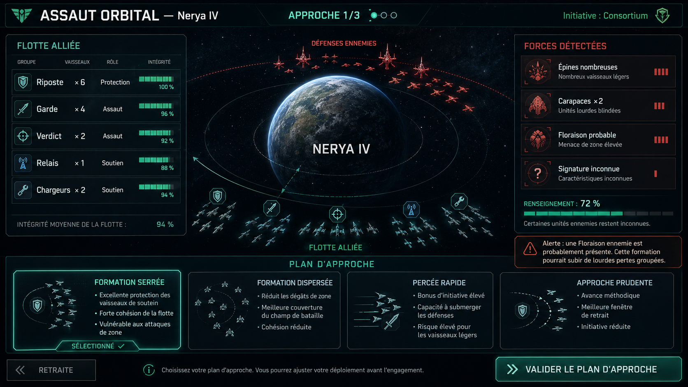

# COMBAT-001 — Ajouter le combat orbital tactique par décisions de commandement

> **Type :** Epic de gameplay  
> **Priorité proposée :** P1 post-MVP  
> **Estimation globale :** 34 points, à découper impérativement en checkpoints  
> **Statut :** Conception prête  
> **Dépendances :** MVP-030-A6, MVP-031, MVP-036  
> **Relation avec MVP-039 :** cette fonctionnalité devrait précéder ou ouvrir MVP-039 afin que les attaques ennemies réutilisent le même moteur de combat.  
> **Base technique inspectée :** commit `29e206df844fc84b67d12063cf83d00ce5a9436d`



---

## 1. Objectif

Remplacer la résolution entièrement automatique des attaques par une courte séquence de décisions tactiques, sans grille et sans contrôle manuel de chaque vaisseau.

Le joueur doit :

1. voir précisément sa propre flotte ;
2. disposer d’informations plus ou moins fiables sur l’adversaire ;
3. choisir une doctrine à chaque round ;
4. observer les conséquences de son choix ;
5. adapter sa stratégie au round suivant ;
6. pouvoir gagner ou perdre une bataille selon ses décisions, même lorsque les forces initiales sont proches.

Le système doit conserver l’échelle stratégique de **Galactic**. Le joueur commande une flotte : il ne pilote pas individuellement les vaisseaux.

### Fantaisie recherchée

> Observer la menace, choisir un plan, accepter un risque, voir le plan se confronter à celui de l’ennemi, puis s’adapter.

---

## 2. État actuel du projet

Le projet possède déjà :

- un combat déterministe ;
- un nombre maximal de rounds configurable ;
- des statistiques d’offense, défense et durabilité ;
- des classes de cibles légères, moyennes et lourdes ;
- des bonus contre certaines classes ;
- des pertes et survivants persistants ;
- des rapports de combat persistants ;
- du butin limité par la capacité cargo ;
- une application atomique du résultat stratégique ;
- une validation empêchant d’appliquer deux fois le même combat ;
- une mission d’attaque nécessitant une planète analysée ;
- un snapshot de l’attaquant et du défenseur lors du lancement de la mission.

Fichiers principalement concernés :

- `crates/galactic_sim/src/combat.rs`
- `crates/galactic_sim/src/mission.rs`
- `crates/galactic_sim/src/mission/attack.rs`
- `crates/galactic_sim/src/command.rs`
- `crates/galactic_sim/src/event.rs`
- `crates/galactic_client/src/mission_wizard.rs`
- `crates/galactic_client/src/fleet_ui.rs`
- nouveau module recommandé : `crates/galactic_client/src/combat_ui.rs`

### Limites actuelles

Le combat actuel :

- agrège la puissance et la coque de chaque camp ;
- résout tous les rounds en un seul appel ;
- ne demande aucune décision après le lancement de la mission ;
- applique proportionnellement les pertes à la fin ;
- transfère actuellement le contrôle de la planète en cas de victoire de l’attaquant ;
- ne permet pas de cibler réellement un type d’unité ;
- ne possède pas d’état de bataille intermédiaire sauvegardable.

Cette issue doit ajouter une couche interactive sans dupliquer le moteur de combat ni casser les sauvegardes, les missions ou les rapports.

---

## 3. Décision de gameplay

### Format retenu

- Aucun quadrillage.
- Aucun déplacement manuel.
- Aucun pilotage individuel.
- **5 rounds par défaut**, valeur configurable.
- À chaque round, le joueur choisit une doctrine.
- L’adversaire choisit aussi une doctrine, cachée avant la résolution.
- Les deux doctrines sont résolues simultanément.
- Le joueur voit un résumé clair du round avant de choisir le suivant.
- Une retraite organisée reste possible.
- Une option de résolution automatique peut terminer les rounds restants.

### Pourquoi une résolution simultanée

La résolution simultanée évite qu’un camp détruise un groupe avant que celui-ci puisse agir. Elle correspond mieux à un commandement de flotte et simplifie l’interface :

```text
Choix du joueur
       +
Choix caché de l'adversaire
       ↓
Résolution simultanée du round
       ↓
Pertes, événements et nouveau renseignement
```

### Durée cible

Une bataille standard doit durer :

- environ 1 à 3 minutes en jouant les choix ;
- quelques secondes avec la résolution automatique ;
- au maximum 5 décisions principales dans la première version.

---

## 4. Déroulement complet d’un combat

### 4.1 Arrivée sur la cible

À l’arrivée d’une mission d’attaque :

1. la mission reste dans la phase `OnSite` ;
2. un état de combat tactique est créé ;
3. la vitesse stratégique du client est mise en pause ;
4. l’interface de combat s’ouvre ;
5. la flotte reste assignée à la mission ;
6. aucune perte stratégique n’est appliquée avant la fin du combat.

Si plusieurs combats du joueur deviennent disponibles au même tick, ils sont placés dans une file et présentés l’un après l’autre.

Les combats ne concernant pas le joueur doivent pouvoir être résolus automatiquement par le même moteur.

### 4.2 Début d’un round

L’interface affiche :

- le numéro du round ;
- les rounds restants ;
- la composition et l’intégrité exactes de la flotte alliée ;
- les renseignements disponibles sur l’adversaire ;
- les doctrines accessibles ;
- le résultat du round précédent ;
- les alertes tactiques importantes.

### 4.3 Choix du joueur

Le joueur sélectionne une doctrine puis valide.

Une doctrine doit toujours présenter :

- son bénéfice principal ;
- son coût ou son risque ;
- ses cibles privilégiées ;
- les menaces connues qui pourraient la contrer ;
- une évaluation qualitative fondée uniquement sur les renseignements révélés.

Aucun pourcentage exact de victoire ne doit être affiché.

### 4.4 Choix adverse

Le choix adverse est déterminé de manière déterministe à partir :

- du profil tactique de la faction ;
- de sa composition ;
- de l’état courant de ses groupes ;
- du round ;
- de la graine du combat ;
- éventuellement de son propre niveau de renseignement.

Le joueur ne voit pas la doctrine ennemie avant la résolution, sauf capacité explicite de renseignement.

### 4.5 Résolution du round

Le round applique dans cet ordre logique :

1. effets de renseignement et de commandement ;
2. calcul des contres entre doctrines ;
3. calcul des priorités de cible ;
4. calcul simultané des dégâts ;
5. répartition des dégâts entre les groupes ciblés ;
6. destruction éventuelle de vaisseaux ;
7. mise à jour de l’intégrité des groupes ;
8. mise à jour du renseignement en direct ;
9. enregistrement du round dans l’historique ;
10. test des conditions de fin.

La simulation doit utiliser des entiers ou du fixe en millièmes. Aucun calcul métier ne doit dépendre de nombres flottants.

### 4.6 Fin du combat

Le combat se termine lorsqu’une condition suivante est remplie :

- un camp ne possède plus de groupe opérationnel ;
- le joueur ordonne une retraite ;
- l’adversaire bat en retraite ;
- les deux camps sont détruits ;
- le nombre maximal de rounds est atteint.

Pour la première version :

- deux camps encore opérationnels après le dernier round produisent une **impasse** ;
- aucune jauge de moral n’est ajoutée ;
- aucun système de reddition n’est ajouté.

### 4.7 Application stratégique

À la fin seulement :

- les pertes sont appliquées à la flotte ;
- les pertes du défenseur sont appliquées à la présence planétaire ;
- le butin est calculé ;
- le rapport final est créé ;
- la mission reprend son déroulement ;
- les survivants repartent ou restent selon le résultat prévu par la mission.

### Décision de compatibilité temporaire

Cette issue ne doit pas résoudre en même temps le futur système de conquête terrestre.

Pour **COMBAT-001**, une victoire doit conserver le comportement stratégique actuel de l’attaque, y compris le changement de contrôle déjà appliqué par le moteur actuel. Une issue ultérieure pourra séparer :

```text
Victoire orbitale
    ↓
Supériorité orbitale
    ↓
Invasion ou capture planétaire
```

Cette décision évite de bloquer la boucle actuelle pendant la refonte du combat.

---

## 5. Doctrines de la première version

Les valeurs ci-dessous sont des valeurs initiales de conception. Elles doivent être configurables dans le ruleset et équilibrées par tests.

### 5.1 Engagement équilibré

Doctrine sans spécialisation forte.

- dégâts normaux ;
- défense normale ;
- ciblage standard ;
- aucune pénalité de répétition ;
- choix de secours lorsque les doctrines spéciales sont peu adaptées.

### 5.2 Assaut concentré

Concentrer les tirs sur les groupes prioritaires.

- bonus offensif recommandé : `+25 %` ;
- malus défensif recommandé : `-15 %` ;
- cible prioritaire : groupes lourds ou groupes déjà endommagés ;
- efficace contre une formation dispersée ;
- vulnérable à un écran défensif.

### 5.3 Écran défensif

Protéger les groupes fragiles et absorber les tirs.

- réduction recommandée des dégâts reçus : `-25 %` ;
- réduction recommandée des dégâts infligés : `-20 %` ;
- les groupes défensifs interceptent une partie des dégâts visant les soutiens ;
- efficace contre un assaut concentré ;
- vulnérable à un contournement.

### 5.4 Manœuvre de contournement

Tenter d’atteindre le soutien et l’arrière-garde.

- bonus recommandé contre les groupes de soutien : `+35 %` ;
- bonus léger d’initiative ou de précision ;
- malus défensif pour les groupes engagés dans la manœuvre ;
- efficace contre un écran défensif ;
- vulnérable à une formation dispersée ou à une forte présence légère.

### 5.5 Formation dispersée

Réduire les dégâts groupés et couvrir plusieurs axes.

- réduction recommandée des dégâts de zone : `-40 %` ;
- réduction de la cohésion ou des bonus de soutien : `-15 %` ;
- améliore l’interception des contournements ;
- efficace contre les attaques de zone et les contournements ;
- vulnérable à un assaut concentré.

### 5.6 Analyse tactique

Sacrifier une partie de la puissance immédiate pour mieux préparer le prochain round.

- malus offensif recommandé pour le round courant : `-25 %` ;
- gain de renseignement recommandé : `+15 points` au round suivant ;
- révèle éventuellement la catégorie de la prochaine doctrine ennemie ;
- peut révéler une signature inconnue ;
- vulnérable à un assaut agressif immédiat.

### Boucle de contres recherchée

```text
Écran défensif
    contre Assaut concentré

Contournement
    contre Écran défensif

Formation dispersée
    contre Contournement

Assaut concentré
    contre Formation dispersée

Analyse tactique
    prépare un avantage futur mais sacrifie le round courant
```

Les contres ne doivent pas annuler complètement une doctrine. Ils doivent modifier sensiblement l’issue sans transformer le système en victoire automatique.

### Répétition d’une doctrine

Pour éviter qu’une doctrine dominante soit sélectionnée à chaque round :

- répéter une doctrine spéciale doit réduire son bonus principal ;
- pénalité recommandée : `-15 %` d’efficacité par répétition consécutive ;
- la pénalité est remise à zéro lorsqu’une autre doctrine est utilisée ;
- `Engagement équilibré` n’est pas concerné.

L’interface doit afficher cette baisse avant validation.

---

## 6. Renseignement de combat

### 6.1 Principe

Le joueur voit toujours sa propre flotte exactement.

Les informations ennemies dépendent d’un pourcentage appelé :

> **Renseignement de combat**

Valeur comprise entre `0` et `100`.

Ce pourcentage doit être dérivé des systèmes déjà présents :

- niveau de connaissance de la planète ou du système ;
- précision du dernier renseignement planétaire ;
- ancienneté du rapport ;
- qualité de la mission d’analyse ;
- présence éventuelle d’un vaisseau ou rôle de reconnaissance ;
- observations acquises pendant les rounds précédents.

Le calcul exact doit être configurable et documenté.

### 6.2 Proposition de progression

Le projet exige déjà une cible analysée pour lancer une attaque. Le renseignement initial devrait donc généralement commencer dans une zone moyenne, pas à zéro.

Proposition de départ :

- cible analysée : base de `45` ;
- renseignement récent et précis : bonus ;
- renseignement ancien : malus progressif ;
- vaisseau de reconnaissance approprié : bonus ;
- chaque round observé : `+5` points ;
- doctrine `Analyse tactique` : bonus supplémentaire ;
- valeur finale limitée entre `5` et `100`.

Les constantes réelles doivent vivre dans le ruleset.

### 6.3 Seuils de révélation

#### 0 à 19 %

Afficher seulement :

- niveau de menace global ;
- présence confirmée ou probable ;
- aucune quantité ;
- aucune intégrité ;
- aucune capacité.

Exemple :

```text
SIGNATURES HOSTILES
Menace globale : importante
Composition : inconnue
```

#### 20 à 39 %

Afficher :

- classes générales ;
- quantités verbales très larges ;
- aucune identité précise.

Exemple :

```text
Unités légères : nombreuses
Unités lourdes : présence probable
Soutien : inconnu
```

#### 40 à 59 %

Afficher :

- types identifiés ;
- quantité sous forme de fourchette large ;
- une capacité principale éventuelle.

Exemple :

```text
Épines : environ 8 à 14
Carapaces : présence confirmée
Floraison : probable
```

#### 60 à 79 %

Afficher :

- types identifiés ;
- quantité approximative avec une erreur déterministe ;
- intégrité qualitative ;
- capacité majeure.

Exemple :

```text
Carapaces : environ 2
Intégrité : élevée
Rôle : blindage lourd
```

#### 80 à 94 %

Afficher :

- quantités presque exactes ;
- intégrité par bande ;
- capacités principales ;
- tendance tactique probable.

#### 95 à 100 %

Afficher :

- quantités exactes ;
- intégrité exacte ou quasi exacte ;
- capacités ;
- doctrine probable ;
- priorité de cible probable.

### 6.4 Obfuscation déterministe

Une information approximative doit rester stable pendant l’affichage.

Interdictions :

- recalculer une fourchette différente à chaque frame ;
- modifier une estimation en fermant puis rouvrant l’interface ;
- utiliser un aléatoire non déterministe ;
- révéler indirectement la valeur réelle par une barre, un tri ou une infobulle.

La valeur affichée doit être dérivée de :

```text
graine du combat
+ identifiant du groupe
+ seuil de renseignement
```

### 6.5 Prévention des fuites d’information

Les informations cachées ne doivent pas être révélées par :

- l’ordre exact des groupes ;
- la longueur d’une barre masquée ;
- le nombre exact d’icônes ;
- les infobulles ;
- la prévisualisation des dégâts ;
- les messages de recommandation ;
- l’activation ou la désactivation d’une doctrine ;
- le rapport intermédiaire ;
- les sons ou animations distinctes.

Une prévision tactique doit utiliser uniquement les informations effectivement révélées.

---

## 7. Modèle métier recommandé

Les noms sont indicatifs, mais la séparation des responsabilités doit être conservée.

```rust
struct FleetCombatState {
    id: FleetCombatId,
    mission_id: MissionId,
    seed: u64,
    round: u8,
    maximum_rounds: u8,
    phase: FleetCombatPhase,
    attacker: CombatSideState,
    defender: CombatSideState,
    player_side: Option<CombatSide>,
    intel: CombatIntelState,
    pending_player_doctrine: Option<CombatDoctrineId>,
    history: Vec<CombatRoundRecord>,
}
```

```rust
enum FleetCombatPhase {
    AwaitingDoctrine,
    Resolving,
    Completed,
}
```

```rust
struct CombatSideState {
    owner: Owner,
    stacks: Vec<CombatStackState>,
    last_doctrine: Option<CombatDoctrineId>,
    consecutive_doctrine_uses: u8,
    retreated: bool,
}
```

```rust
struct CombatStackState {
    stack_id: CombatStackId,
    craftable_or_force: CombatUnitRef,
    initial_quantity: u64,
    surviving_quantity: u64,
    current_hull: u64,
    maximum_hull: u64,
    target_class: CombatTargetClass,
    tactical_role: CombatTacticalRole,
}
```

```rust
struct CombatRoundRecord {
    round: u8,
    attacker_doctrine: CombatDoctrineId,
    defender_doctrine: CombatDoctrineId,
    attacker_damage: u64,
    defender_damage: u64,
    attacker_losses: Vec<CombatUnitLoss>,
    defender_losses: Vec<CombatUnitLoss>,
    attacker_intel_after: u8,
    defender_intel_after: u8,
    notable_events: Vec<CombatRoundEvent>,
}
```

### Règles importantes

- L’état tactique est la seule source de vérité pendant le combat.
- La flotte stratégique reste verrouillée par sa mission.
- Les pertes stratégiques ne sont appliquées qu’à la finalisation.
- Les groupes doivent posséder des identifiants stables.
- Les dégâts partiels peuvent exister pendant le combat.
- La première version peut ne persister que le nombre final de vaisseaux, comme aujourd’hui.
- Les dégâts partiels d’un vaisseau survivant peuvent être ignorés après le combat tant qu’aucun système de réparation unitaire n’existe.
- Ce comportement doit être explicite dans les tests et le rapport.

---

## 8. Refactor du moteur de combat

Le moteur interactif et la résolution automatique ne doivent pas devenir deux algorithmes différents.

### API pure recommandée

```rust
fn prepare_fleet_combat(...) -> Result<FleetCombatState, CombatError>;
```

```rust
fn resolve_combat_round(
    state: &FleetCombatState,
    player_doctrine: CombatDoctrineId,
    enemy_doctrine: CombatDoctrineId,
    rules: &FleetCombatRules,
) -> CombatRoundResolution;
```

```rust
fn apply_round_resolution(
    state: &mut FleetCombatState,
    resolution: CombatRoundResolution,
) -> Result<(), CombatError>;
```

```rust
fn finalize_fleet_combat(
    state: &FleetCombatState,
) -> Result<CombatResolution, CombatError>;
```

### Résolution automatique

La fonction actuelle `resolve_combat` doit être :

- conservée comme façade de compatibilité ;
- ou refactorée pour exécuter le nouveau moteur round par round ;
- avec une sélection déterministe de doctrines pour les deux camps.

Il ne doit pas exister un ancien calcul agrégé pour l’auto-résolution et un second calcul par groupes pour l’interface.

### Ciblage

Les doctrines doivent influencer réellement :

- la sélection des groupes ciblés ;
- la redirection de dégâts ;
- les bonus contre les classes ;
- la protection des soutiens ;
- les dégâts de zone ;
- la priorité donnée aux groupes endommagés.

Une doctrine ne doit pas se limiter à ajouter `+10 %` à la puissance globale sans modifier le comportement observable.

---

## 9. Ruleset

Ajouter un fichier dédié recommandé :

```text
assets/rulesets/default/combat_tactics.ron
```

Contenu attendu :

- version ;
- nombre maximal de rounds ;
- seuils de renseignement ;
- gain de renseignement par round ;
- pénalité d’ancienneté ;
- modificateurs de chaque doctrine ;
- matrice de contres ;
- pénalité de répétition ;
- règles de ciblage ;
- paramètres de l’IA ;
- durée des animations côté client si celle-ci n’est pas purement visuelle.

Le chargement doit :

- refuser une version inconnue ;
- refuser les doublons ;
- refuser les pourcentages hors limites ;
- vérifier qu’une doctrine équilibrée existe ;
- vérifier que toutes les doctrines utilisées par l’IA existent ;
- produire une empreinte structurelle compatible avec les sauvegardes et les tests.

---

## 10. Commandes et événements

Toute décision doit passer par la couche de commandes de la simulation.

Commandes recommandées :

```rust
GameCommand::ChooseCombatDoctrine {
    mission_id,
    doctrine,
}
```

```rust
GameCommand::RetreatFromCombat {
    mission_id,
}
```

```rust
GameCommand::AutoResolveCombat {
    mission_id,
}
```

Événements recommandés :

```rust
GameEvent::CombatDecisionRequired
GameEvent::CombatRoundResolved
GameEvent::CombatIntelUpdated
GameEvent::CombatCompleted
GameEvent::CombatRetreatRejected
```

### Contraintes

- Une commande reçue deux fois ne doit pas appliquer deux rounds.
- Une doctrine ne peut être choisie que si le combat attend une décision.
- Une commande pour un ancien round doit être rejetée.
- Le joueur ne peut pas commander le camp adverse.
- Une retraite ne peut pas être demandée après la finalisation.
- Les erreurs doivent produire un message UI compréhensible.

---

## 11. Intégration aux missions

### Mission d’attaque

À l’arrivée :

```text
Outbound
   ↓
OnSite + combat en attente
   ↓
Décisions tactiques
   ↓
Combat finalisé
   ↓
Returning / Completed / Failed
```

Le combat tactique ne doit pas avancer le temps stratégique à chaque décision dans la première version. Tous les rounds sont considérés comme faisant partie de la résolution sur site.

Cela permet de conserver une durée stratégique courte et d’éviter de recalculer toute la chronologie de retour.

### Invalidations existantes

Conserver les cas existants :

- propriétaire de la cible modifié ;
- présence planétaire modifiée ;
- flotte attaquante modifiée ;
- mission déjà résolue.

Si la cible devient invalide avant l’arrivée, aucun écran tactique ne doit être créé.

Si le combat a déjà commencé, les sources stratégiques sont verrouillées jusqu’à sa fin.

### Plusieurs combats simultanés

- stocker tous les combats valides ;
- ouvrir le premier combat appartenant au joueur ;
- conserver les autres dans une file ;
- ne pas perdre un événement en rechargeant une sauvegarde ;
- auto-résoudre les combats n’impliquant pas de décision du joueur.

---

## 12. Sauvegarde, chargement et migration

Le combat doit être intégralement sérialisable.

À sauvegarder :

- round courant ;
- état de chaque groupe ;
- doctrines déjà utilisées ;
- pénalité de répétition ;
- renseignement courant ;
- historique des rounds ;
- graine ;
- phase ;
- décision éventuellement sélectionnée mais non validée, uniquement si ce comportement est souhaité ;
- lien vers la mission.

### Rechargement

Après chargement :

- un combat en attente doit rouvrir automatiquement l’interface ;
- les groupes et barres doivent retrouver exactement leur état ;
- le prochain round doit produire le même résultat ;
- aucun rapport ne doit être dupliqué ;
- le temps stratégique doit rester cohérent.

### Migration

Les anciennes sauvegardes ne contiennent aucun combat tactique.

Comportement recommandé :

- une ancienne mission d’attaque encore en trajet crée normalement son combat à l’arrivée ;
- une mission déjà résolue conserve son ancien rapport ;
- aucun ancien rapport ne doit être transformé ;
- augmenter la version de sauvegarde si un champ non optionnel est ajouté ;
- préférer un nouveau champ optionnel avec validation explicite lorsque cela réduit le risque de migration.

---

## 13. IA tactique

### Première version

L’IA adverse ne doit pas chercher le coup parfait.

Elle utilise :

- un profil de faction ;
- des poids par doctrine ;
- quelques règles de priorité ;
- la graine du combat pour départager les choix ;
- une pénalité de répétition identique à celle du joueur.

Exemple de profil Sylve :

- préfère l’assaut si elle possède beaucoup d’unités légères ;
- préfère la dispersion face à des dégâts de zone ;
- préfère le contournement si le joueur possède beaucoup de soutiens ;
- utilise l’analyse tactique rarement ;
- devient plus agressive au dernier round.

Exemple de profil humain défensif :

- protège d’abord les unités endommagées ;
- privilégie l’écran défensif ;
- tente une retraite si la puissance opérationnelle devient très faible.

### Anti-triche

L’IA ne doit pas exploiter une information que le design lui interdit explicitement.

Toutefois, la première version peut lui donner une connaissance complète de la composition adverse si cela simplifie le développement. Cette décision doit être documentée et ne doit pas être présentée comme une simulation de renseignement équitable.

---

## 14. Interface attendue

### 14.1 Structure générale

Créer une vue plein écran ou une surcouche modale couvrant la carte.

```text
┌─────────────────────────────────────────────────────────────────────┐
│ ASSAUT ORBITAL — Nerya IV      ROUND 2/5      Combat en pause       │
├──────────────────┬────────────────────────────┬─────────────────────┤
│ FLOTTE ALLIÉE    │                            │ FORCES DÉTECTÉES    │
│                  │       Planète cible        │                     │
│ Riposte ×6       │                            │ Épines nombreuses   │
│ Garde ×4         │   arcs et groupes orbitaux │ Carapaces ≈2        │
│ Verdict ×2       │                            │ Floraison probable  │
│ Relais ×1        │    événements du round     │ Signature inconnue  │
│                  │                            │                     │
│ Intégrité exacte │                            │ Renseignement 72 %  │
├──────────────────┴────────────────────────────┴─────────────────────┤
│ CHOISIR UNE DOCTRINE                                                │
│ [Assaut] [Écran] [Contournement] [Dispersion] [Analyse]             │
│                                                                     │
│ [Retraite]                      [Résolution auto] [Valider le round] │
└─────────────────────────────────────────────────────────────────────┘
```

### 14.2 En-tête

Afficher :

- nom de la cible ;
- round actuel et nombre maximal ;
- statut : sélection, résolution ou terminé ;
- camp du joueur ;
- nombre de combats en attente, le cas échéant ;
- bouton d’aide contextuelle.

### 14.3 Colonne alliée

Afficher exactement :

- nom du groupe ;
- quantité initiale et quantité restante ;
- rôle tactique ;
- intégrité ;
- état : intact, endommagé, critique, détruit ;
- doctrine ou effet actif ;
- protection ou ciblage en cours.

Les quantités propres au joueur ne sont jamais masquées.

### 14.4 Zone centrale

Afficher :

- la planète ou le lieu du combat ;
- des arcs orbitaux décoratifs ;
- les groupes alliés et ennemis sous forme d’icônes agrégées ;
- les cibles du round ;
- les interceptions ;
- les dégâts principaux ;
- les événements importants.

Aucun déplacement libre n’est requis.

Le placement est une visualisation du plan, pas une donnée tactique manipulable.

### 14.5 Colonne ennemie

Afficher seulement ce que permet le renseignement :

- type ou classe ;
- quantité exacte, approximative ou verbale ;
- intégrité exacte, qualitative ou inconnue ;
- capacités révélées ;
- signatures inconnues ;
- niveau de confiance.

La barre de renseignement doit afficher un pourcentage et un libellé :

```text
RENSEIGNEMENT : 72 %
Certaines unités et capacités restent inconnues.
```

### 14.6 Cartes de doctrine

Chaque carte doit contenir :

- nom ;
- icône ;
- bénéfice ;
- risque ;
- cible privilégiée ;
- contre connu ;
- pénalité de répétition éventuelle ;
- raccourci clavier ;
- état sélectionné.

Exemple :

```text
ASSAUT CONCENTRÉ

+ Dégâts offensifs importants
+ Priorité aux unités lourdes
- Défense réduite
- Risque élevé face à un écran défensif

Menace connue :
Des Carapaces lourdes ont été détectées.
```

### 14.7 Prévision qualitative

Afficher au maximum :

- très défavorable ;
- défavorable ;
- incertain ;
- favorable ;
- très favorable.

Cette prévision doit :

- utiliser uniquement les informations révélées ;
- afficher une confiance faible si le renseignement est mauvais ;
- ne jamais calculer visiblement la bataille avec les données cachées ;
- pouvoir se tromper.

### 14.8 Résolution visuelle d’un round

Après validation :

- verrouiller les cartes ;
- révéler la doctrine ennemie ;
- afficher les contres déclenchés ;
- animer brièvement les tirs et interceptions ;
- mettre à jour les barres ;
- afficher les pertes ;
- afficher deux à quatre événements majeurs ;
- autoriser le passage rapide de l’animation.

Durée cible : 1 à 2 secondes, avec possibilité d’accélérer.

### 14.9 Rapport final

Afficher :

- résultat ;
- rounds joués ;
- doctrines des deux camps ;
- pertes alliées exactes ;
- pertes ennemies selon le niveau de renseignement final ;
- groupes ayant joué un rôle décisif ;
- butin ;
- changement de contrôle ;
- état de la mission ;
- boutons de retour à la galaxie et d’ouverture du rapport persistant.

---

## 15. UX et accessibilité

- Ne pas distinguer les camps uniquement par rouge et vert.
- Ajouter formes, icônes et libellés.
- Prévoir les résolutions `1280×720` et `1920×1080`.
- À `720p`, permettre une grille de cartes de doctrine en `2 × 3`.
- Aucun texte ne doit déborder.
- Les listes longues doivent défiler sans déplacer les actions principales.
- Raccourcis recommandés :
  - `1` à `6` : doctrines ;
  - `Entrée` : valider ;
  - `R` : retraite avec confirmation ;
  - `A` : résolution automatique ;
  - `Espace` : accélérer ou passer l’animation.
- `Échap` ne doit pas fermer silencieusement un combat obligatoire.
- Une fermeture doit soit revenir à la galaxie avec un marqueur de combat en attente, soit être interdite.
- Les animations ne doivent jamais être nécessaires pour comprendre le résultat.
- Le journal textuel doit reprendre les événements essentiels.

---

## 16. Subtilités à ne pas oublier

### Source de vérité

Ne jamais modifier directement les quantités de la flotte stratégique à chaque round. La flotte est mise à jour une seule fois lors de la finalisation atomique.

### Dégâts partiels

Le système doit définir clairement comment une coque partiellement endommagée produit une perte entière.

La règle doit être déterministe et testée.

### Destruction mutuelle

Les dégâts étant simultanés, les deux camps peuvent être détruits au même round.

### Retraite

Une retraite :

- conserve les survivants ;
- abandonne le contrôle ou l’objectif ;
- ne récupère pas nécessairement tout le butin ;
- doit produire un rapport ;
- doit être déterministe ;
- peut subir une pénalité configurable au dernier round ou face à certaines doctrines.

### Impasse

Une impasse :

- ne change pas le contrôle ;
- conserve les pertes des deux camps ;
- fait repartir l’attaquant selon le fonctionnement de la mission ;
- produit un rapport.

### Butin

Conserver :

- calcul du butin récupérable ;
- limite de capacité cargo ;
- récupération uniquement selon les conditions de victoire prévues ;
- absence de débordement.

### Recommandations UI

Une recommandation ne doit jamais connaître plus d’informations que le joueur.

### Rounds fixes

Le nombre de rounds doit être configuré. Le code ne doit jamais supposer exactement cinq rounds.

### Sélection double

Un double-clic ou deux commandes identiques ne doivent pas résoudre deux rounds.

### Rechargement

Recharger pendant une animation doit reprendre sur un état métier stable, pas au milieu d’une transition visuelle.

### Combat déjà terminé

L’interface doit se fermer proprement si un événement de finalisation est reçu avant son rafraîchissement.

---

## 17. Hors périmètre

- Grille tactique.
- Déplacement case par case.
- Contrôle individuel des vaisseaux.
- Combat en temps réel.
- Orientation des vaisseaux.
- Collisions physiques.
- Simulation balistique 3D.
- Modules de vaisseaux.
- Officiers et expérience.
- Moral complexe.
- Abordage.
- Combat terrestre.
- Transport de soldats.
- Conquête planétaire en plusieurs étapes.
- Interception pendant le trajet.
- Multijoueur.
- Replay cinématique complet.
- Persistance des dégâts détaillés par vaisseau survivant.
- Nouvelle direction artistique complète.

---

## 18. Découpage recommandé

### COMBAT-001-A — Construire le moteur de rounds tactiques

**Estimation : 8 points**

- nouveau modèle de combat intermédiaire ;
- groupes avec coque courante ;
- résolution simultanée ;
- doctrines de base ;
- ciblage par rôle et classe ;
- conditions de fin ;
- façade d’auto-résolution utilisant le même moteur ;
- tests purs déterministes.

### COMBAT-001-B — Ajouter le renseignement et l’IA tactique

**Estimation : 5 points**

- pourcentage de renseignement ;
- seuils de révélation ;
- obfuscation déterministe ;
- gain de renseignement par round ;
- doctrine Analyse tactique ;
- profils IA ;
- absence de fuite d’information ;
- tests des seuils.

### COMBAT-001-C — Intégrer le combat aux missions et sauvegardes

**Estimation : 8 points**

- création du combat à l’arrivée ;
- état en attente de décision ;
- commandes ;
- événements ;
- file de combats ;
- finalisation atomique ;
- rapports enrichis ;
- sérialisation ;
- migration ;
- validation d’état.

### COMBAT-001-D — Créer l’interface de combat

**Estimation : 8 points**

- nouveau module `combat_ui.rs` ;
- vue plein écran ;
- panneaux allié et ennemi ;
- planète et formations centrales ;
- cartes de doctrine ;
- résolution visuelle ;
- rapport final ;
- raccourcis ;
- responsive 720p et 1080p.

### COMBAT-001-E — Équilibrer, polir et sécuriser

**Estimation : 5 points**

- résolution automatique ;
- prévision qualitative ;
- messages d’erreur ;
- équilibrage des doctrines ;
- smoke test complet ;
- tests de sauvegarde en plein combat ;
- tests avec plusieurs combats simultanés ;
- documentation du ruleset ;
- playtest externe.

---

## 19. Tests métier obligatoires

### Déterminisme

- même snapshot, même graine et mêmes doctrines produisent le même round ;
- même combat complet produit le même rapport ;
- recharger avant un round ne modifie pas le résultat ;
- l’auto-résolution est déterministe.

### Doctrines

- un écran défensif réduit réellement les dégâts reçus ;
- un contournement peut cibler le soutien ;
- une formation dispersée réduit les dégâts de zone ;
- un assaut concentré cible correctement les groupes prioritaires ;
- l’analyse tactique augmente le renseignement du round suivant ;
- la répétition réduit l’efficacité prévue ;
- un contre modifie sensiblement le résultat sans l’annuler.

### Renseignement

- à faible niveau, aucune quantité exacte n’est exposée ;
- l’estimation reste stable entre deux rafraîchissements ;
- augmenter le renseignement ne peut pas réduire les informations déjà révélées ;
- les barres masquées ne révèlent pas une valeur exacte ;
- la prévision utilise les données visibles uniquement ;
- un rapport final respecte le niveau de renseignement atteint.

### Missions

- un combat est créé une seule fois à l’arrivée ;
- la mission reste verrouillée pendant le combat ;
- les pertes ne sont appliquées qu’à la fin ;
- une retraite fait reprendre correctement la mission ;
- une cible invalide ne crée pas de combat ;
- deux combats arrivant au même tick sont tous conservés ;
- une mission reprise après sauvegarde termine au même état.

### Application stratégique

- aucune perte n’est appliquée deux fois ;
- une destruction totale supprime correctement la flotte ;
- les survivants sont réinjectés dans la composition ;
- le butin respecte la capacité cargo ;
- l’impasse ne change pas le contrôle ;
- la destruction mutuelle est valide ;
- le rapport persistant contient tous les rounds.

### Validation

- aucun combat ne référence une mission inexistante ;
- aucun groupe ne possède une coque négative ou supérieure à son maximum ;
- aucun round ne dépasse le maximum ;
- un combat terminé n’attend plus de doctrine ;
- une mission terminée ne possède pas de combat actif ;
- les identifiants de groupes sont uniques.

---

## 20. Scénarios de playtest

### Scénario A — Forces proches

- deux flottes de puissance comparable ;
- une bonne suite de doctrines doit produire une victoire ;
- une mauvaise suite doit produire une défaite ou une impasse.

### Scénario B — Mauvais renseignement

- renseignement initial inférieur à `50 %` ;
- présence d’une unité de soutien inconnue ;
- le joueur doit pouvoir se tromper sans subir une information mensongère incohérente.

### Scénario C — Protection du soutien

- flotte alliée avec Relais ou Chargeurs ;
- ennemi capable de contournement ;
- l’écran défensif doit réellement sauver des unités fragiles.

### Scénario D — Analyse puis adaptation

- premier round avec Analyse tactique ;
- révélation d’une menace lourde ;
- second round avec Assaut concentré ;
- le gain futur doit compenser le sacrifice initial dans certaines configurations.

### Scénario E — Retraite

- combat clairement défavorable ;
- retrait au troisième round ;
- pertes conservées ;
- survivants retournant correctement ;
- rapport compréhensible.

### Scénario F — Sauvegarde en plein combat

- sauvegarde après le deuxième round ;
- fermeture du jeu ;
- chargement ;
- même interface, mêmes groupes, même prochain résultat.

---

## 21. Critères d’acceptation

### Gameplay

- [ ] Une bataille standard comporte un nombre fixe de rounds configurables.
- [ ] Le joueur choisit une doctrine à chaque round.
- [ ] Les doctrines modifient le ciblage, la protection ou la répartition des dégâts.
- [ ] Les choix peuvent changer l’issue d’un combat entre forces proches.
- [ ] L’adversaire choisit une doctrine de façon déterministe.
- [ ] Les dégâts sont résolus simultanément.
- [ ] Le joueur peut battre en retraite.
- [ ] Une résolution automatique est disponible.
- [ ] Une impasse est possible après le dernier round.
- [ ] Aucun déplacement manuel n’est nécessaire.

### Renseignement

- [ ] Un pourcentage de renseignement est visible.
- [ ] La flotte alliée est toujours affichée exactement.
- [ ] Les forces ennemies sont masquées ou approximées selon les seuils.
- [ ] Les estimations restent stables.
- [ ] L’analyse tactique peut améliorer le renseignement.
- [ ] Aucune donnée cachée ne fuit par l’UI.
- [ ] La prévision reste qualitative et peut être incertaine.

### Interface

- [ ] La vue contient la flotte alliée, la zone orbitale et les forces détectées.
- [ ] Les doctrines sont lisibles avec bénéfices et risques.
- [ ] Le round courant et les rounds restants sont visibles.
- [ ] Le résultat du round précédent est compréhensible.
- [ ] Les pertes sont visibles immédiatement.
- [ ] Le rapport final récapitule les décisions.
- [ ] L’interface reste utilisable en 1280×720.
- [ ] L’interface reste lisible en 1920×1080.
- [ ] Les informations ne reposent pas uniquement sur la couleur.

### Technique

- [ ] Le moteur reste déterministe.
- [ ] L’auto-résolution utilise le même moteur.
- [ ] L’état de combat est sérialisable.
- [ ] Une sauvegarde en plein combat peut être reprise.
- [ ] Les pertes sont appliquées atomiquement.
- [ ] Un combat ne peut pas être appliqué deux fois.
- [ ] Les anciens rapports restent lisibles.
- [ ] Les règles tactiques sont configurables.
- [ ] Les invariants de sauvegarde sont validés.
- [ ] Les tests Rust existants restent verts.

---

## 22. Commandes qualité attendues

À exécuter à chaque checkpoint :

```bash
cargo fmt --all
cargo check --workspace --all-targets --all-features
cargo clippy --workspace --all-targets --all-features -- -D warnings
cargo test --workspace
cargo build --release
```

Ajouter au minimum :

- tests unitaires du moteur ;
- tests d’intégration mission/combat ;
- tests de sérialisation ;
- test de migration ;
- smoke test d’une bataille complète ;
- test manuel 720p ;
- test manuel 1080p.

---

## 23. Définition de réussite

Cette epic est réussie lorsqu’un joueur peut :

1. lancer une attaque avec une flotte existante ;
2. arriver sur une cible ;
3. comprendre exactement ses propres forces ;
4. estimer imparfaitement les forces ennemies ;
5. choisir une doctrine ;
6. voir pourquoi elle fonctionne ou échoue ;
7. adapter son choix au round suivant ;
8. battre en retraite ou poursuivre ;
9. obtenir un résultat persistant ;
10. sauvegarder et reprendre la partie pendant le combat ;
11. constater qu’une meilleure suite de décisions peut changer l’issue d’un affrontement équilibré.

La phrase directrice du système est :

> **La flotte détermine les possibilités. Les décisions déterminent comment elles sont utilisées.**
